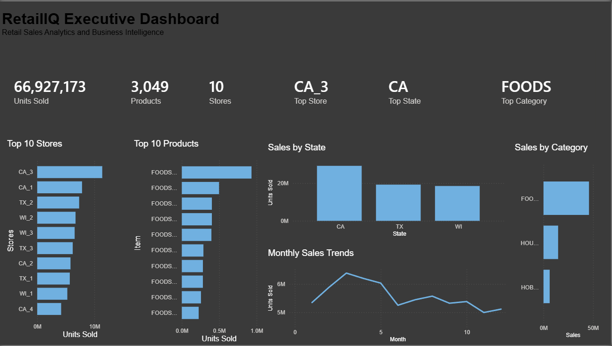
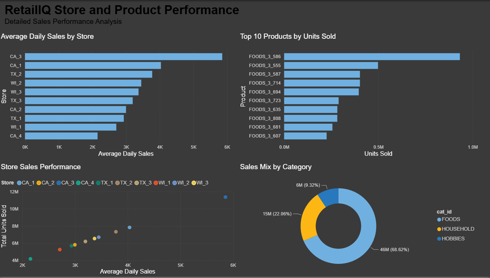
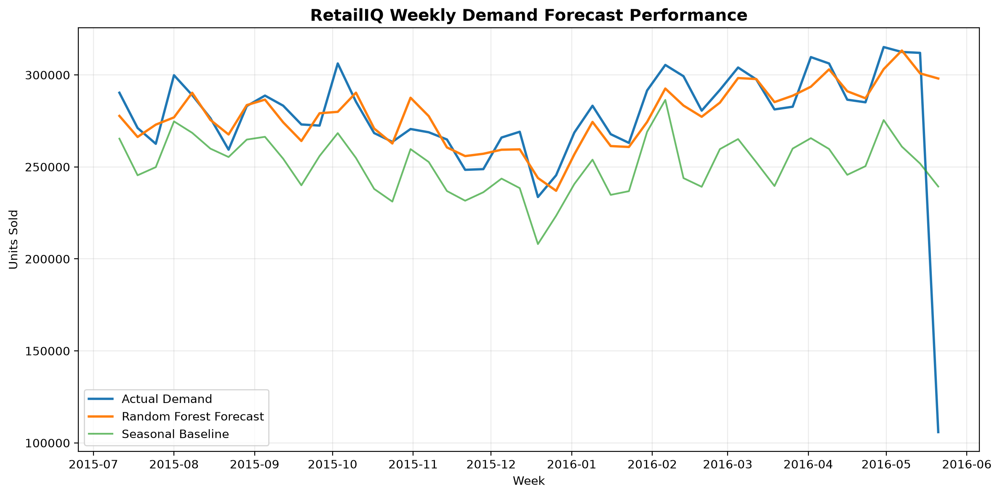
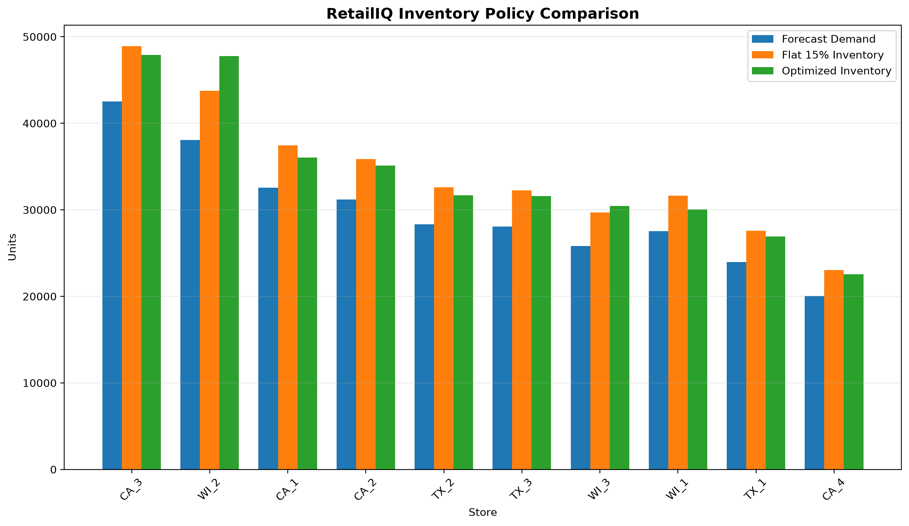

# RetailIQ

## Retail Demand Forecasting & Inventory Optimization Platform

RetailIQ is an end-to-end retail analytics platform that transforms raw retail sales data into validated, analytics-ready information for business intelligence, demand forecasting, and inventory decision support.

The project demonstrates a complete analytics workflow spanning data engineering, SQL warehouse design, business analytics, Power BI reporting, machine learning forecasting, and data-driven inventory recommendations using the M5 retail dataset.

---

## Architecture

```text
Raw M5 Retail Data
        |
        v
Data Profiling & Validation
        |
        v
Data Cleaning
        |
        v
Wide-to-Long Transformation
        |
        v
SQLite Data Warehouse
        |
        v
SQL Views & Summary Tables
        |
        v
Python Business Analytics
        |
        v
Power BI Dashboard
        |
        v
Weekly Demand Forecasting
        |
        v
Inventory Recommendations
```

---

## Project Highlights

RetailIQ currently includes:

- End-to-end Python ETL pipeline
- Rule-based data validation and automated reporting
- Memory-optimized processing of large retail datasets
- SQL star-schema-style analytical warehouse
- More than **66 million sales records**
- SQL indexes, analytical views, and summary tables
- Python-based business analytics
- Automated Power BI data exports
- Two-page executive Power BI dashboard
- Weekly store-level demand forecasting
- Seasonal forecasting benchmark
- Random Forest demand forecasting model
- Time-based model validation
- Next-week demand predictions for all stores
- Data-driven safety stock calculations
- Store-level inventory recommendations
- Automated end-to-end analytics pipeline

---

## Technology Stack

- Python
- Pandas
- NumPy
- scikit-learn
- Matplotlib
- PyArrow
- SQLite
- SQL
- Power BI
- Git
- GitHub
- VS Code

---

## Data Warehouse

RetailIQ uses a star-schema-style analytical warehouse with three dimensions and two core fact tables.

### Dimension Tables

- `dim_calendar`
- `dim_product`
- `dim_store`

### Fact Tables

- `fact_daily_sales`
- `fact_sell_prices`

### Reporting Layer

- `summary_store_sales`
- `summary_state_sales`
- `summary_product_sales`
- `summary_category_sales`
- `summary_monthly_sales`

The warehouse contains more than **66 million sales records**.

Precomputed summary tables reduce the amount of data downstream analytics and business intelligence tools need to process.

---

## ETL Pipeline

The core ETL workflow is organized into reusable stages:

```text
01_data_overview.py
02_data_validation.py
03_data_cleaning.py
04_transform_sales.py
05_build_database.py
06_load_database.py
07_create_indexes.py
08_create_views.py
09_create_summary_tables.py
```

The pipeline moves raw source data through profiling, validation, cleaning, transformation, database loading, indexing, and analytical table creation.

Several stages automatically generate documentation in the `reports/` directory.

---

## Analytics Layer

RetailIQ includes a Python analytics layer that queries the SQL warehouse and prepares business-focused datasets for reporting.

The analytics workflow produces outputs including:

- Monthly unit sales
- Top-selling products
- Store performance
- State performance
- Category sales
- Executive KPIs
- Average daily store sales

Dashboard datasets are exported to:

```text
reports/dashboard_data/
```

This separates the large analytical warehouse from the lightweight datasets consumed by Power BI.

---

## Power BI Dashboard

RetailIQ includes a two-page Power BI report designed for executive reporting and detailed performance analysis.

### Page 1 — Executive Dashboard

The executive dashboard provides a high-level view of retail performance, including:

- **66,927,173 total units sold**
- **3,049 products**
- **10 stores**
- Top-performing store
- Top-performing state
- Top-performing category
- Monthly sales trends
- Top 10 products
- Top 10 stores
- Sales by state
- Sales by category

### Page 2 — Store & Product Performance

The detailed performance page includes:

- Average daily sales by store
- Top 10 products by units sold
- Store sales performance comparison
- Category sales mix

---

## Dashboard Preview

### Executive Dashboard



### Store & Product Performance



---

## Demand Forecasting

RetailIQ converts daily sales history into store-level weekly demand observations for forecasting.

The forecasting workflow includes:

1. Weekly sales aggregation
2. Lag feature engineering
3. Rolling demand features
4. Calendar features
5. Seasonal baseline forecasting
6. Time-based training and testing
7. Random Forest regression
8. Forecast evaluation
9. Next-week demand generation

Historical features include:

- Previous-week demand
- 2-week lag
- 4-week lag
- 13-week lag
- 52-week seasonal lag
- 4-week rolling average
- 13-week rolling average
- 26-week rolling average
- Month
- Quarter
- Week of year
- Store

The model uses a chronological train/test split rather than a random split to prevent future observations from leaking into model training.

---

## Forecasting Results

The Random Forest model substantially outperformed the seasonal benchmark on the held-out future test period.

| Model | MAE | MAPE |
|---|---:|---:|
| Seasonal Baseline | 3,439 units | 13.88% |
| Random Forest | **1,607 units** | **8.22%** |

### Model Improvement

The Random Forest reduced Mean Absolute Error by:

> **53.27% compared with the seasonal baseline**

This means the machine-learning model reduced average weekly store-level forecasting error from approximately **3,439 units to 1,607 units** on the test period.

### Forecast Performance



---

## Next-Week Demand Forecast

After model validation, RetailIQ uses recent historical demand features to generate next-week demand predictions for each store.

The latest forecasting run predicted approximately:

> **298,036 total units of demand across 10 stores**

The forecasting workflow also detects and excludes an incomplete final historical week before generating future predictions.

These forecasts provide the demand input for the inventory recommendation layer.

---

## Inventory Optimization

RetailIQ converts predicted demand into store-level inventory recommendations.

Two inventory policies are compared.

### Baseline Policy

The baseline inventory policy applies a flat:

> **15% safety-stock buffer**

to predicted demand at every store.

### Data-Driven Policy

The optimized policy estimates each store's demand uncertainty using the standard deviation of its most recent **26 weeks of sales**.

Safety stock is calculated using:

```text
Safety Stock = 1.645 × Standard Deviation of Weekly Demand
```

The model uses `1.645` as a simplified approximately **95% one-sided service-level factor**.

This approach allows stores with more volatile demand to receive larger buffers while stores with more predictable demand require less excess inventory.

---

## Inventory Results

For the evaluated forecast period:

- Forecast demand: **298,036 units**
- Optimized recommended inventory: **340,059 units**
- Flat 15% policy inventory: **342,741 units**
- Estimated inventory reduction: **2,682 units**

The optimized approach therefore recommends approximately:

> **2,682 fewer inventory units than the flat 15% policy**

while applying a data-driven safety-stock policy based on historical store-level demand variability.

This represents an estimated inventory reduction under the model assumptions rather than a measured cost saving.

### Inventory Policy Comparison



---

## Key Business Insights

RetailIQ identified several descriptive and predictive performance patterns:

- **FOODS** is the dominant product category by unit sales.
- **California** generates the highest state-level sales volume.
- **CA_3** is the highest-performing store by total units sold.
- Store demand varies substantially across locations.
- Monthly demand changes materially throughout the historical period.
- Recent demand patterns provide substantial predictive value for future store sales.
- The Random Forest model outperformed a same-season historical benchmark.
- Store-specific demand variability produces different safety-stock requirements.
- A uniform inventory buffer can over-allocate inventory to some stores while under-allocating it to others.

---

## Automated Pipeline

RetailIQ includes a centralized `run_pipeline.py` controller for executing the project's major analytical stages.

The automated workflow connects:

```text
Data Profiling
    ↓
Data Validation
    ↓
Data Cleaning
    ↓
Sales Transformation
    ↓
Database Build & Load
    ↓
Indexes & Views
    ↓
Summary Tables
    ↓
Business Analytics
    ↓
Dashboard Exports
    ↓
Forecast Preparation
    ↓
Baseline Forecast
    ↓
Machine Learning Forecast
    ↓
Forecast Evaluation
    ↓
Future Demand Forecast
    ↓
Inventory Recommendations
    ↓
Inventory Optimization
```

The controller stops execution if a stage fails and reports stage-level execution times.

---

## Automated Reports

RetailIQ generates reports and analytical outputs including:

- Data quality report
- Validation report
- Cleaning report
- Transformation report
- Dashboard datasets
- Forecast evaluation metrics
- Forecast predictions
- Future store forecasts
- Inventory recommendations
- Optimized inventory recommendations
- Forecast visualization
- Inventory policy visualization

---

## Project Structure

```text
RetailIQ/
|
├── data/
│   ├── raw/
│   ├── processed/
│   ├── forecasting/
│   └── sample/
|
├── database/
|
├── docs/
|
├── reports/
│   ├── dashboard_data/
│   ├── forecasting/
│   └── inventory/
|
├── sql/
|
├── src/
│   ├── analytics/
│   ├── etl/
│   ├── forecasting/
│   └── inventory/
|
├── dashboard/
│   └── screenshots/
|
├── notebooks/
├── tests/
|
├── run_pipeline.py
├── README.md
├── requirements.txt
└── .gitignore
```

Large raw datasets, processed datasets, and generated database files are excluded from GitHub where appropriate and can be recreated using the project pipeline.

---

## SQL Layer

The SQL layer includes:

- Warehouse table creation
- Index creation
- Analytical views
- Business queries
- Precomputed summary tables

The analytical layer supports questions such as:

- Which stores generate the highest unit sales?
- Which products and categories drive the most demand?
- How does demand differ by state?
- How does demand change over time?
- Which stores have the strongest average daily performance?
- What is expected store demand next week?
- How much safety stock should each store carry?
- How can inventory buffers be adjusted for differences in demand variability?

---

## Development Status

- [x] Project foundation
- [x] Business requirements
- [x] Data acquisition
- [x] Data profiling
- [x] Data validation
- [x] Data cleaning
- [x] Sales transformation
- [x] SQL warehouse design
- [x] Automated database loading
- [x] SQL indexes
- [x] SQL views
- [x] Summary reporting tables
- [x] Exploratory business analysis
- [x] Dashboard data export pipeline
- [x] Power BI executive dashboard
- [x] Store and product performance dashboard
- [x] Pipeline automation
- [x] Forecast feature engineering
- [x] Seasonal forecasting baseline
- [x] Machine-learning demand forecasting
- [x] Time-based model evaluation
- [x] Future demand forecasting
- [x] Baseline inventory policy
- [x] Data-driven inventory optimization
- [x] Forecast and inventory visualizations
- [x] Version 1.0 core analytical system

---

## Model Limitations

RetailIQ V1.0 is a portfolio analytics system and has several important limitations:

- Forecasting currently operates at the **store-week level**, not individual SKU-store level.
- The Random Forest model is evaluated on historical M5 data and has not been validated against live retail operations.
- Inventory recommendations do not currently incorporate supplier lead times.
- Holding costs, ordering costs, stockout penalties, and current on-hand inventory are not included.
- The approximately 95% service-level assumption is a modeling choice rather than a retailer-specific business requirement.
- Forecast and inventory results should therefore be interpreted as analytical decision support rather than production ordering instructions.

These limitations provide clear opportunities for future development.

---

## Future Enhancements

Potential extensions include:

- SKU-store-level demand forecasting
- Supplier lead-time modeling
- Current inventory integration
- Holding-cost and stockout-cost optimization
- Forecast confidence intervals
- Additional forecasting algorithms
- Automated model selection
- Cloud deployment
- Interactive forecasting controls

---

## Dataset

RetailIQ uses the **M5 Forecasting dataset**, which contains historical retail sales, pricing, calendar, event, and store information.

The raw dataset is not stored in the repository due to file size.

Users must obtain the dataset separately and place the required source files in:

```text
data/raw/
```

---

## Project Goal

RetailIQ demonstrates how raw retail transaction data can be transformed into descriptive, predictive, and prescriptive analytics.

The system progresses through three levels of decision support:

```text
DESCRIPTIVE
What happened?
      ↓
Power BI & SQL Analytics

PREDICTIVE
What is likely to happen?
      ↓
Machine Learning Demand Forecasting

PRESCRIPTIVE
What should the business do?
      ↓
Inventory Recommendations
```

The central business question is:

> **How much inventory should each store carry to meet expected demand while limiting unnecessary inventory?**

RetailIQ V1.0 provides an end-to-end analytical framework for answering that question.

---

## Author

**Miller Lockwood**